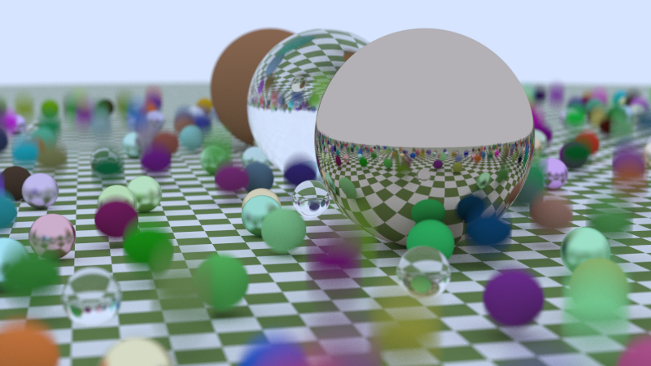
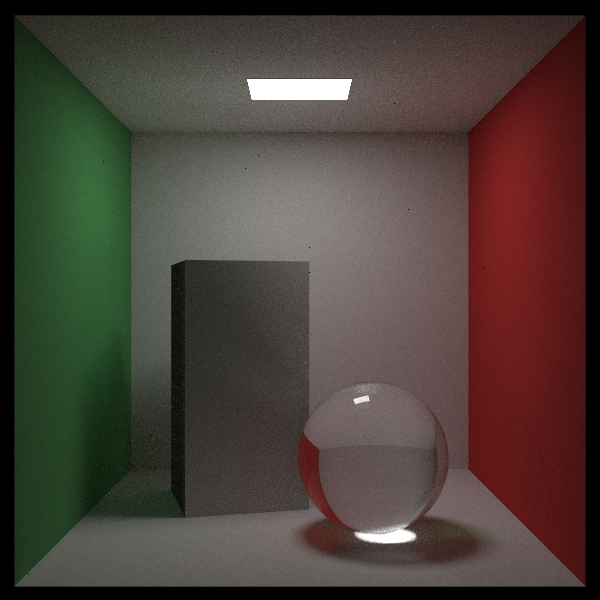

# raytrace-rs

A ray-tracing engine adapted from the "Ray Tracing" series by Peter Shirley. Namely, the resources are:
1. [Ray Tracing in One Weekend](https://raytracing.github.io/books/RayTracingInOneWeekend.html)
2. [Ray Tracing: The Next Week](https://raytracing.github.io/books/RayTracingTheNextWeek.html)
3. [Ray Tracing: The Rest of Your Life](https://raytracing.github.io/books/RayTracingTheRestOfYourLife.html)

Fully implemented in [Rust](https://www.rust-lang.org/).

Some of the renders:

## Requirements
`rand`: 0.8.4

`rayon`: 1.5

`indicatif`: 0.16.2

`image`: 0.23.14
